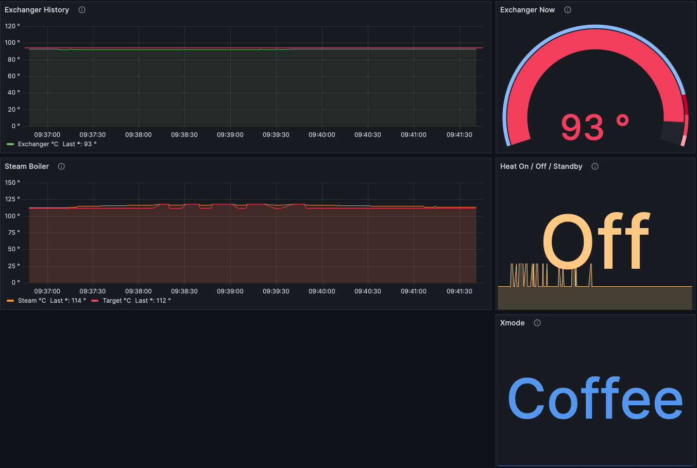

# Mara X Monitoring



Capture temperature data from a Lelit Mara X espresso machine via a serial connection and persist in a database and expose via grafana.

Docker will persist DB storage using volumes so restarts won't cause data loss.

Tested on a Raspberry Pi 3b+ (Raspberry Pi OS Stable - 12 Bookworm).

All credit to the author of this [post](https://www.reddit.com/r/espresso/comments/hft5zv/data_visualisation_lelit_marax_mod/) for doing so much of the ground work!

## How to run

### 1. Start everything running

Run grafana / influxDB / ingestion via docker-compose with the following in a terminal

```shell
[sudo] docker-compose up --build
```

This can now be backgrounded (`Ctrl-z`)

### 2. View Graphs

- Visit http://localhost:3000 in a browser on the same machine to view grafana
  - Default username `admin`
  - Default password `admin`
  - You'll be prompted to change these
- Navigate to Dashboards -> Manage (http://localhost:3000/dashboards)
- Open Mara X folder and choose dashboard

### 3. Setup external access (Optional)

- Determine IP address of raspberry pi on your local network
  - Something like `192.168.1.160`
  - Visit http://192.168.1.160:3000 via a browser

Alternatively, setup [tailscale](https://tailscale.com/) for access from outside your local network.

## What do I need?

- Lelit Mara X V2 espresso machine ([link](https://marax.lelit.com/index-eng.html))
- Serial to USB cable ([link](https://amzn.eu/d/3va2gX6))
- Computer capable of running linux / docker, like a raspberry pi ([link](https://www.raspberrypi.org/products/raspberry-pi-4-model-b/))

## Other

- Mara X logs cleared daily
- Influx DB retention policy set to 2 weeks, see [here](./config/influxdb/influxdb-init.iql)
